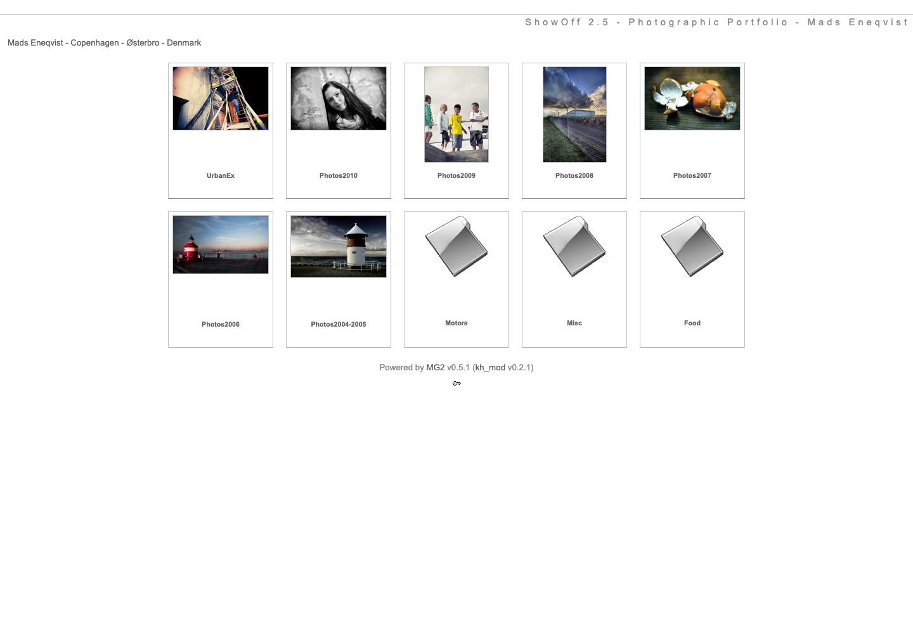
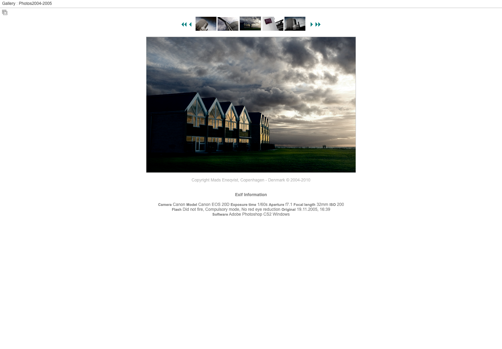

# MG2 PHP 8

MG2 PHP 8 is an independent, community-maintained revival of **MG2 0.5.1**, originally created by **Thomas Rybak** at [MiniGal](http://www.minigal.dk/), with the **kh_mod 0.2.1** extensions from [tangata.de](http://www.tangata.de/kh_mod/).

The goal is to preserve MG2's small, flat-file, dependency-free photo gallery while making it usable on PHP 8 and addressing known legacy security problems. It does not require a SQL database.

This repository contains application code only. Photographs, gallery databases, settings, logs, passwords, and server backups are intentionally excluded.

## Screenshots

Gallery overview:



Individual image view with navigation and EXIF information:



Screenshots are from the maintained gallery at [galleri.eneq.dk](https://galleri.eneq.dk/) and are included with permission. The displayed photographs remain copyright Mads Eneqvist.

## Project status

This is preservation work on a legacy application. It has received a focused PHP 8 compatibility and security pass, but not a comprehensive professional security audit. Test upgrades on a copy of your gallery, keep regular backups, and do not treat the application as suitable for high-risk or sensitive deployments.

## Requirements

- PHP 8.0 or newer
- PHP GD extension
- A web server capable of denying public access to the `data/` directory
- Write access for the PHP/web-server user to `data/` and `pictures/`
- Apache with `.htaccess` support is the tested configuration

No Composer packages, JavaScript build tools, or database server are needed.

## Download

For the traditional MG2 installation experience, download the ready-to-upload ZIP from the [latest GitHub release](https://github.com/madseneqvist/mg2-php8/releases/latest). The release also includes a SHA-256 checksum file so the download can be verified.

The ZIP contains the gallery files at its root. Extract it, upload its contents to `public_html` (or a gallery subdirectory), and then open `mg2_install.php` in your browser.

## New installation

### 1. Download MG2 PHP 8

Download the ready-to-upload ZIP from the [latest release](https://github.com/madseneqvist/mg2-php8/releases/latest), or clone the repository:

```sh
git clone https://github.com/madseneqvist/mg2-php8.git
cd mg2-php8
```

Alternatively, download a release archive and extract it into the document root or subdirectory where the gallery should run.

### 2. Configure write access

The PHP/web-server user must be able to write to these directories:

```text
data/
pictures/
```

On a typical Linux host, set ownership to the account used by the web server and grant only the access it needs. For example:

```sh
sudo chown -R www-data:www-data data pictures
sudo chmod -R 775 data pictures
```

The correct user and group vary by host. Avoid `chmod 777` unless a hosting provider leaves no safer option.

### 3. Protect runtime data

The included `.htaccess` and `data/.htaccess` files deny direct HTTP access on Apache. Confirm that your host allows these rules—usually with `AllowOverride FileInfo AuthConfig` or `AllowOverride All`.

For Nginx, add an equivalent rule inside the relevant `server` block:

```nginx
location ^~ /data/ {
    deny all;
    return 403;
}

location ~ ^/(?:php_errorlog|readme\.txt|liesmich\.txt)$ {
    deny all;
    return 403;
}
```

If MG2 is installed in a subdirectory, adjust these locations accordingly. Do not continue until requesting `data/` or `data/mg2_settings.php` from a browser returns `403` or `404`.

### 4. Run the installer

Open the following URL in a browser, replacing the host and path as needed:

```text
https://example.com/mg2/mg2_install.php
```

Complete the installer and choose a strong, unique administrator password. The installer creates `data/mg2_settings.php`; after that file exists, the installer automatically responds with `404` and cannot be run again.

### 5. Sign in and verify

Open:

```text
https://example.com/mg2/admin.php
```

After signing in:

1. Review the gallery title, administrator email, language, and image settings.
2. Upload a test image and verify its thumbnail and full-size page.
3. Create a test protected gallery and confirm its password works in a private browser window.
4. Back up `data/` and `pictures/`.

## Upgrading an existing MG2 gallery

Do not run the installer over an existing gallery.

1. Back up the complete existing installation, especially `data/`, `pictures/`, custom skins, and `.htaccess` files.
2. Test the upgrade in a separate directory or staging site first.
3. Replace the application files with this repository's files.
4. Restore your existing `data/`, `pictures/`, and any custom skins. Do not overwrite the repository's security rules without reproducing equivalent protection.
5. Ensure `data/` and `pictures/` remain writable by PHP.
6. Open the gallery and `admin.php`, then test image display, uploads, comments, folder editing, and protected galleries.

Existing gallery password hashes remain supported. Newly created gallery passwords use PHP's current password hashing API. The administrator password remains compatible with the original MG2 settings format.

All nine skins bundled with this repository have been updated for PHP 8. Third-party skins or locally customized templates copied from an older MG2 installation may still contain legacy PHP syntax and should be reviewed separately before use.

## Backups

MG2 stores its state in files rather than a database. A useful backup must include:

- `data/` — settings, gallery structure, comments, and other runtime records
- `pictures/` — originals and generated images
- Any custom skins or locally modified files

Keep backups outside the public web root and test that they can be restored.

## Changes in this fork

- Replaced PHP APIs removed in PHP 8, including `create_function`, `split`, and `each`.
- Replaced legacy constructors and curly-brace string offsets.
- Corrected invalid numeric literals and unquoted template keys.
- Removed reliance on short PHP open tags.
- Added secure admin session cookies and session-ID rotation.
- Disabled the installer after configuration.
- Blocked direct access to runtime data and logs.
- Added exact extension checks and image-content validation for uploads.
- Added basic browser security headers.
- Removed the obsolete browser-support popup from the admin editor.
- Added modern hashing for new protected-gallery passwords while retaining legacy verification.

See [CHANGELOG.md](CHANGELOG.md) for the change history and [SECURITY.md](SECURITY.md) for security guidance and vulnerability reporting.

## Original project and attribution

MG2 was written by **Thomas Rybak** and released as MG2 0.5.1 through **MiniGal** at `minigal.dk`. The original source identifies Thomas Rybak as its author and copyright holder. This distribution preserves the original copyright, license, and attribution notices.

The source also incorporates **kh_mod 0.2.1**, historically published at `tangata.de/kh_mod/`, plus bundled third-party components whose notices remain in their files.

An earlier independent PHP 8 revival by viulian contains additional historical context and compatibility work: [bitbucket.org/viulian/mg2](https://bitbucket.org/viulian/mg2).

This community fork is not affiliated with or endorsed by the original authors. Historical websites are linked for attribution and may no longer be maintained or available.

## Contributing

Bug reports and small, reviewable compatibility or security improvements are welcome. Please read [CONTRIBUTING.md](CONTRIBUTING.md) before submitting a change. For vulnerabilities, follow the private-reporting guidance in [SECURITY.md](SECURITY.md).

## License

MG2 is distributed under the GNU General Public License, version 2 or, at your option, any later version. See [LICENSE](LICENSE). Bundled third-party files retain their existing notices and applicable licenses.
